# Calendar, Periods and Time Tables for Microsoft Power BI and Fabric  

## Table of Contents

- [Calendar, Periods and Time Tables for Microsoft Power BI and Fabric](#calendar-periods-and-time-tables-for-microsoft-power-bi-and-fabric)
  - [Table of Contents](#table-of-contents)
  - [Introduction](#introduction)
  - [Repository Content](#repository-content)
  - [Tabular Editor](#tabular-editor)
  - [Creating Tables](#creating-tables)
    - [From Power BI Desktop](#from-power-bi-desktop)
    - [From Dataflows gen1 with License PRO](#from-dataflows-gen1-with-license-pro)
    - [From Dataflows gen2 to Lakehouse Fabric and Direct Lake Semantic Model](#from-dataflows-gen2-to-lakehouse-fabric-and-direct-lake-semantic-model)
      - [Run C# Scripts in Tabular Editor trough Power BI Desktop](#run-c-scripts-in-tabular-editor-trough-power-bi-desktop)
      - [Run C# Scripts in Tabular Editor with connection string](#run-c-scripts-in-tabular-editor-with-connection-string)

## Introduction

This repository provides scripts and resources to generate calendar, periods, and time tables for use in Microsoft Power BI and Fabric. These tools simplify temporal analysis and enhance the creation of detailed and dynamic reports. Whether you're starting a new project or improving an existing one, these assets will help you manage date and time data more efficiently.

## Repository Content

- Folder [**powerquery_code**](powerquery_code) contains the M scripts to paste in blank queries in the Power Query. They work perfectly in Power BI Desktop, Dataflows gen1 and gen2.  

- Folder [**tabular_editor_scripts**](tabular_editor_scripts) contains the C# scripts to use in the Tabular Editor to: 
  - Organize columns in folders by each granularity;
  - Sort text columns by ordinal columns;
  - Removes aggregations of all columns;
  - Apply  `Short Date` format to columns with date type;
  - Marks as the date table;
  - Make relationship beetwen Calendar and Periods table.  

- Folder [**pbix_files**](pbix_files) contains individual .pbix files already loaded by language within the Calendar, Periods and Time tables. Good for a initial project.

- Folder [**assets**](assets) just contains auxiliary files and images to the structure of this repository.  

## Tabular Editor

For a better experience, I strongly recommend installing the third-party software **Tabular Editor**. It's a very important tool for the day-to-day of Power BI developers. See below the link of download the free version. 

[**Download Tabular Editor 2**](https://github.com/TabularEditor/TabularEditor/releases/)  

> There is a comercial version with aditional features. If you are interested then you can see in [https://tabulareditor.com/pricing](https://tabulareditor.com/pricing).  

Follow these instructions to install and setup Tabular Editor:
1. Download and install the latest version of Tabular Editor from link above;  
2. Close all Power BI Desktop windows and run the Tabular Editor;
3. Go to File > Preferences and checks the box `Allow unsupported Power BI features (experimental)`.
   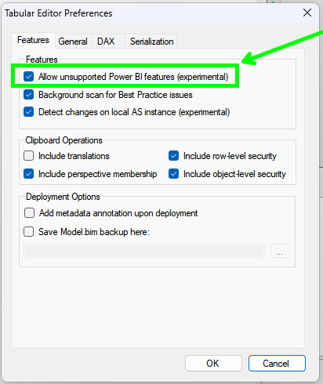
4. Close the Tabular Editor. It's ready to accept the C# Scripts fully supported.  

## Creating Tables

### From Power BI Desktop

1. Create a new or open a existing file in the Power BI Desktop.
2. Go to Home > Transform Data.  
   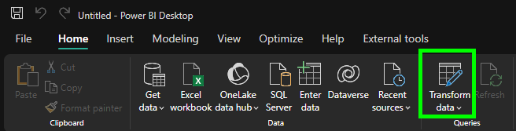  
3. In the Power Query create a new `Blank Query`.  
   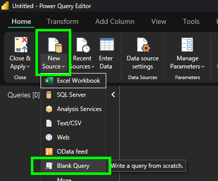
4. Rename this query to `Calendar`  
   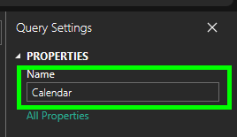  
5. Go to the code [calendar.pq](powerquery_code/calendar.pq) and copy it by clicking on `Raw`.  
   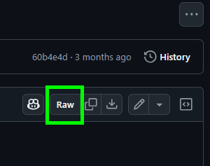  
6. Return to Power Query, right-click on the query `Calendar` then clink on `Advanced Editor`.  
   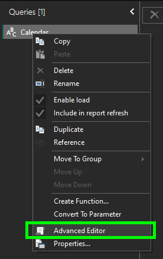
7. In the Advanced Editor, press Ctrl + A to select all, then press Ctrl + V to paste, overwriting any existing code and press `Done`.  
8. In the `APPLIED STEPS` scroll to the first steps and alter the parameters if necessary:  
   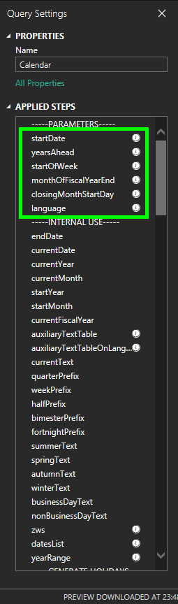  

    - **startDate**  
      Specify the start date. Default: #date(2020, 1, 1)  
    - **yearsAhead**  
      Years ahead today. Default: 1  
    - **startOfWeek**  
      Specify the start of the week. Default: Day.Monday 
    - **monthOfFiscalYearEnd**  
      Specify the month of the fiscal year end. Default: 3 (March)  
    - **closingMonthStartDay**  
      Start day of the closing month.  
      Default: 16 (it means the closing month goes from the 16th of the current month to the 15th of the next month)  
    - **language**
      Available: "en-US", "pt-BR", "es-ES"  

9. Create a new blank query and renames it to `Periods`.  
10. Copy the code [periods.pq](powerquery_code/periods.pq) and paste into Advanced Editor in the same way as the `Calendar`.  
11. Set up the parameters for the `Periods` table according to the name and language of the Calendar for example:
    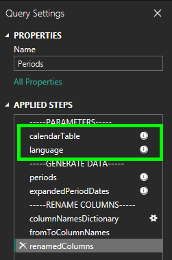  
        
    Set the name of the calendar_table  
    **calendarTable** = Table.Buffer(Calendar)  
    
    Set the same language of calendar table  
    **language** = "en-US" 

12. Create a new blank query and renames it to `Time`.
13. Copy the code [time.pq](powerquery_code/time.pq) and paste into the Advanced Editor in the same way to the previous tables.
14. Specify the language to the `Time` table in the step `language`. 

15. Go to Home > Close and apply.  
16. Save the file.  
17. Go to the `Model view` and certifies that there isn't any relationship beetween these tables.  
    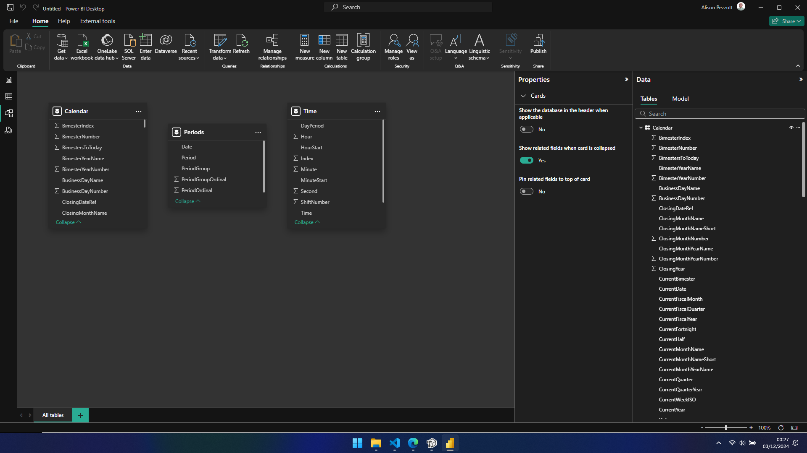  
18. In the superior menu go to `External tools` > `Tabular Editor`.  
19. The Tabular Editor opens, and if a message like the following image appears, don't worry about it. It's just a alert of experimental features. Press ok.  
    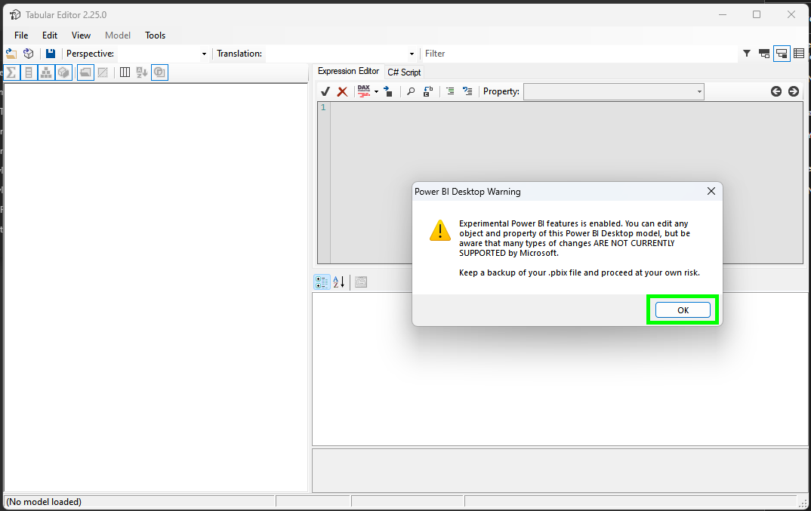  
20. Go to [tabular_editor_calendar`Periods`time.cs](tabular_editor_scripts/tabular_editor_calendar`Periods`time.cs) copy raw code. Returns to the Tabular Editor and paste in the C# Script window.  Confirm the used language to generate tables and their respective names. Run the script clicking in the paly icon or pressing `F5`. In the sequence press `Ctrl + S` and close the Tabular Editor.  
    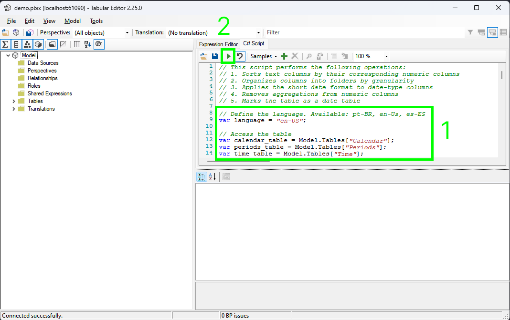  
    This script was written to supply when the three tables was loaded. If you want create just one of then individually then use the individual scripts on the [tabular_editor_scripts](tabular_editor_scripts)  folder.  
21. Returns to the Power BI Desktop and a alert should be shown. Click on the button to refresh.
    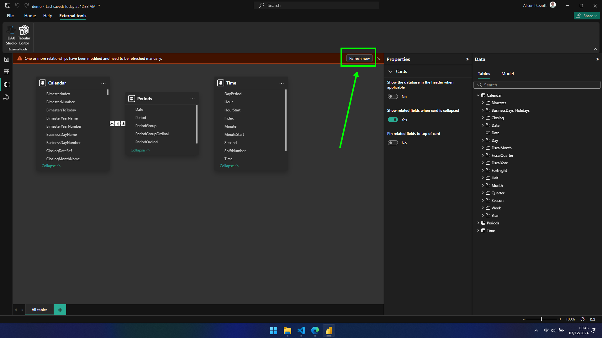  
22. Voilá! The columns of Calendar were organized in folders and sorted and the Periods table was relationed correctly. If you are a moralist of modeling like me should be repared a Many to Many relationship beetwen from the Periods to Calendar. Don't worry this ocurs due the dates repeat across the periods aggregation. How the purpose of this table is be used to slicing data or custom axis for visuals the performance isn't be prejudicated.
    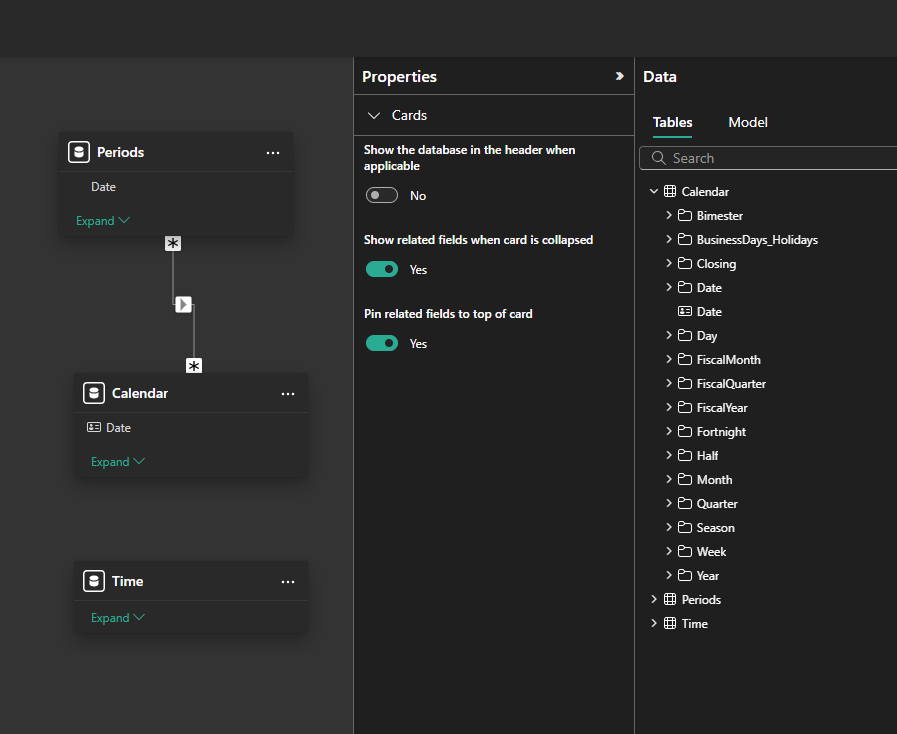  

### From Dataflows gen1 with License PRO

The process is like the desktop but there's a little difference: We need to stage the `Calendar` table due to limitations of the PRO license.  

1. In the Power BI Services, create a dataflow in your workspace.
   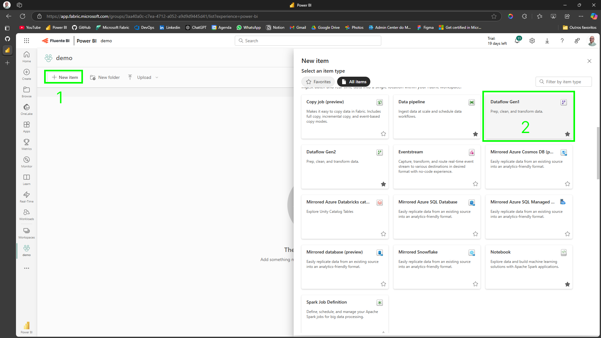
2. Click `Add new tables`.
   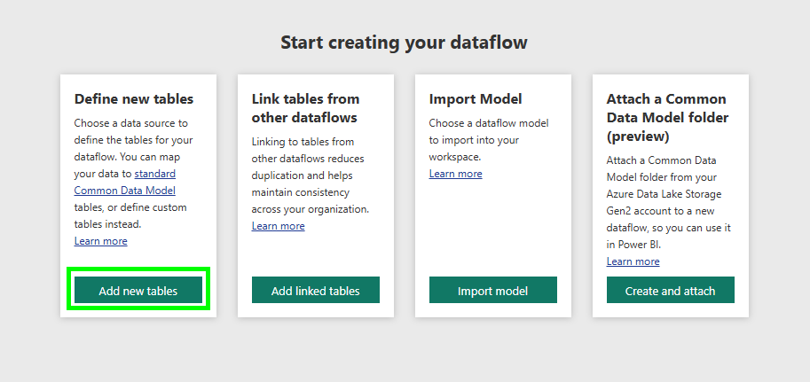  
3. Choose `Blank query`. 
   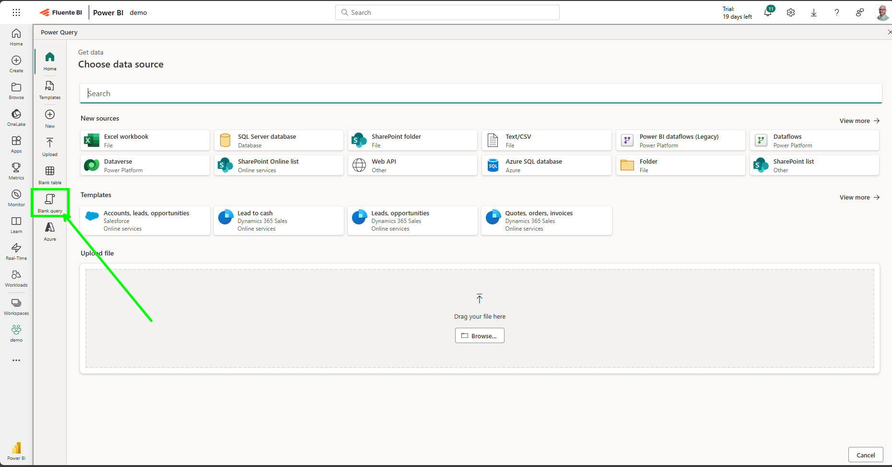  
4. Paste the code from [calendar.pq](powerquery_code/calendar.pq) and press `Next`.
5. Rename the query to `CalendarBase` and disable the load clicking in the query with right button and unchecking `Enable load`. Adjust the parameters if necessary.  
   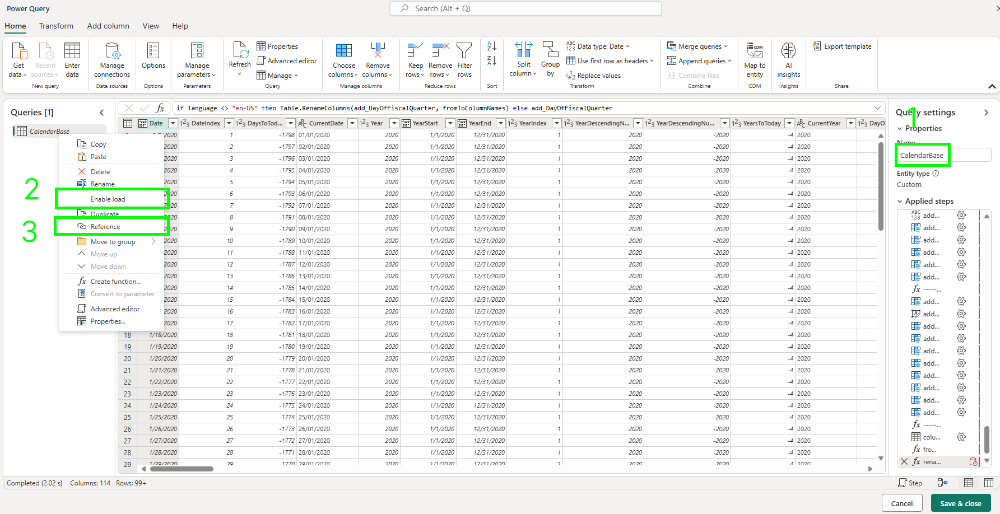  
6. Create a reference of the query and rename it to `Calendar`.    
   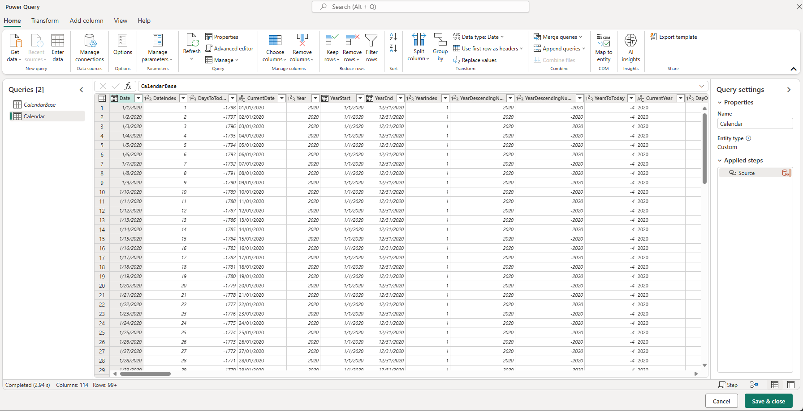  
7. Create a new query and rename it to `Periods`. Copy and paste the code from [periods.pq](powerquery_code/periods.pq). In the variable `calendarTable` use the `CalendarBase` inside of Table.Buffer as your reference. Inform the same language of the `Calendar` table.
8. Create a new query  and renamed to `Time`. Copy and past the code from [time.pq](powerquery_code/time.pq).
9. Click on `Save & close` and give a name to your dataflow and save. Click on the `Refresh Now` button.
10. In the Power BI Desktop creates a new file or from a existing go to Power Query clicking in Home > Transform Data.  
11. In the Power Query click on New Source > More > Power Platform > Dataflows > Connect.  
    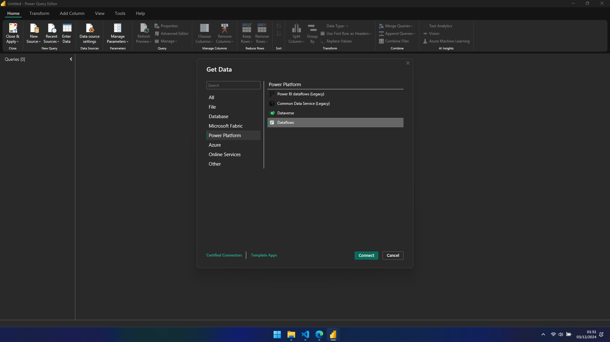  
12. Tick the tables and  then click on OK.
    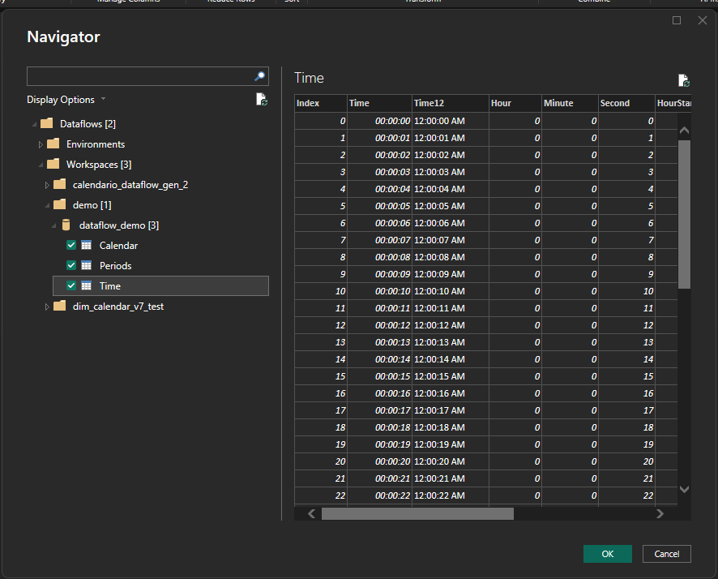  
13. Close and apply.

From this point the process is the same way from the iten 17 until item 22 of the previous topic.  
The creation of the `CalendarBase` table is necessary just if you have a PRO License and want to use the `Periods` table together.  
If you have a PPU License or if you want to use just the `Calendar` without `Periods`, you don't need to create the `CalendarBase`.

### From Dataflows gen2 to Lakehouse Fabric and Direct Lake Semantic Model

1. From a Fabric Workspace create a Lakehouse if doesn't exists.
2. Add a new dataflow gen2 click on + New item > All iitens > Get data > Dataflow Gen2.
   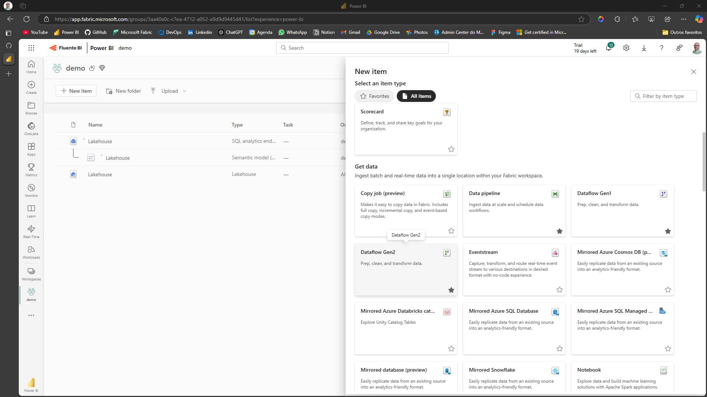
3. Create tables following the steps from 3 until 14 of section [From Power BI Desktop](###_from_power_bi_desktop).
4. The main difference beetwen dataflows gens is the mandatory destination of dataflow gen2. For each table click in the right lower corner and select `LakeHouse`.  
   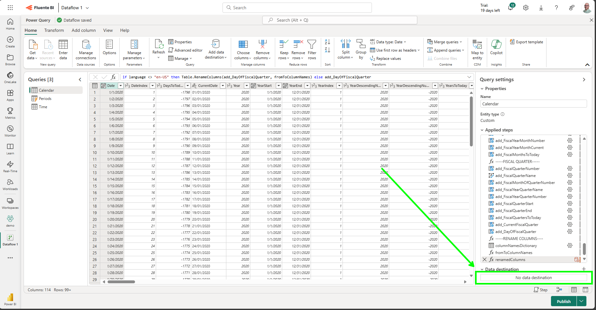  
   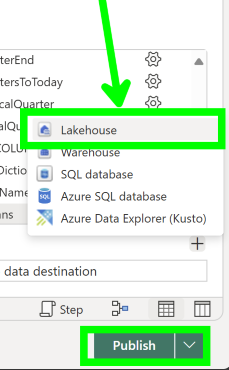  
5. Click on next.  
     
6. Select the `LakeHouse` and next.  
   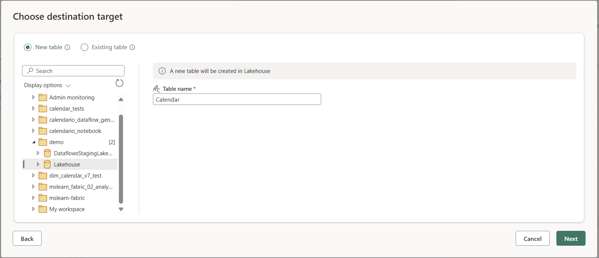  
7. See the column mapping of the new table has been created. I wrote the code with PascalCase for column names, so any column will be renamed. Just click on Save settings.  
   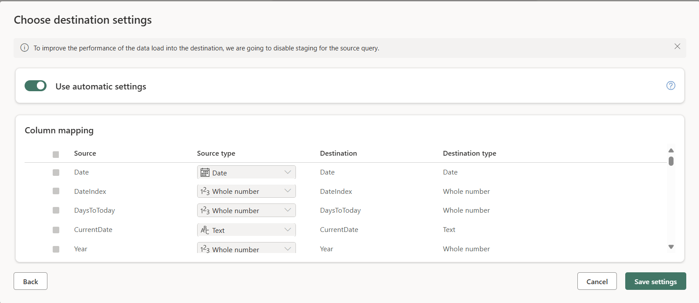  
8. Repeat this process to `Periods` and `Time` tables and click on `Publish`.  
9. At this moment the dataflow gen2 is going to be published and refreshed. Open the `LakeHouse` and review at `Tables` the created tables. Don't worry about how they are displayed.  
    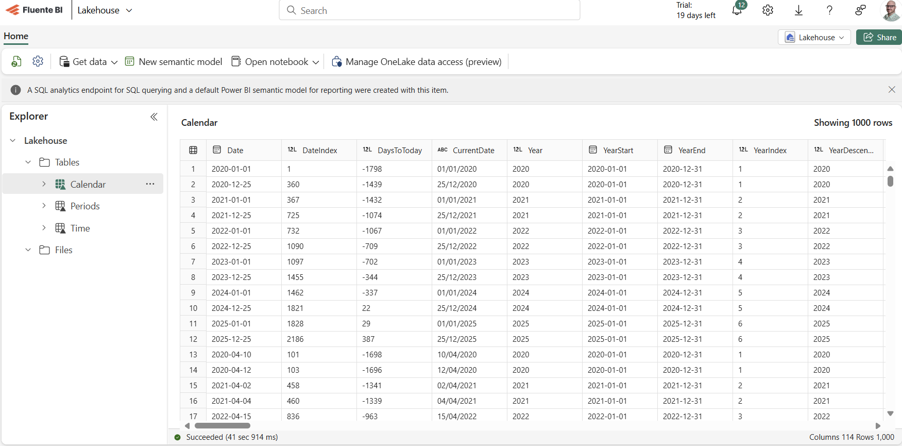  
10. Click on `New Semantic Model`.  
    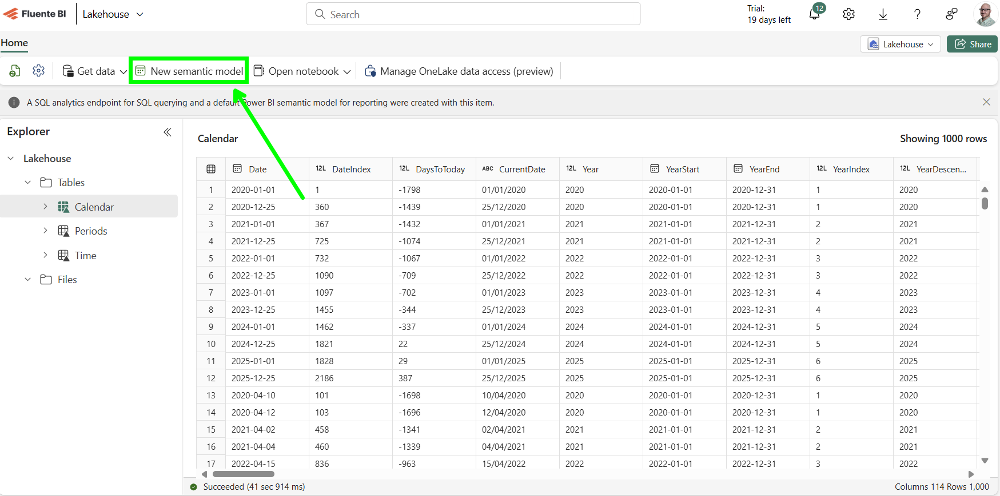  
11. Give a name to the semantic model, select three tables and Confirm.  
    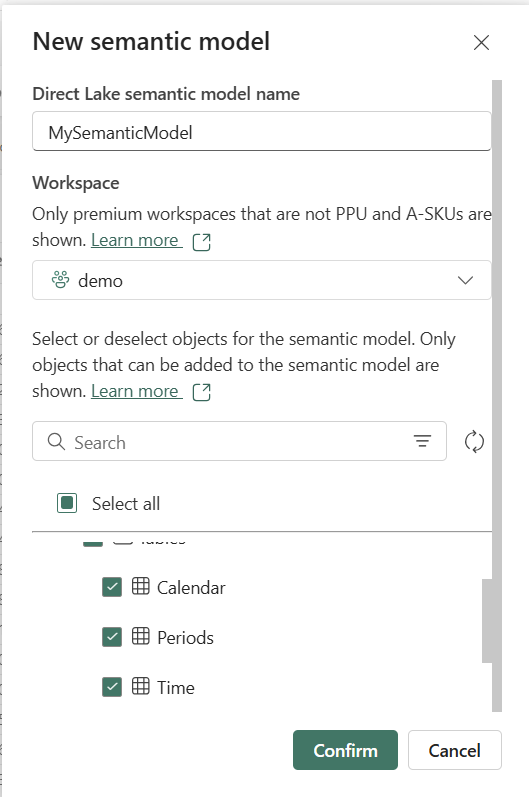  
12. The semantic model is created.  
    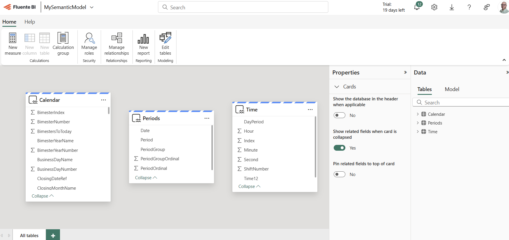  

Now, you can run the scripts C# in Tabular Editor. There are two ways to do this. The first is trough Power BI Desktop editing the semantic model with a Direct Lake connection.  
The second way is trough a connection string without Power BI Desktop. You can choose whichever you prefer; the results are the same.  

#### Run C# Scripts in Tabular Editor trough Power BI Desktop

1. Open Power BI Desktop and click on `OneLake data hub` and after `Power BI semantic models`.  
   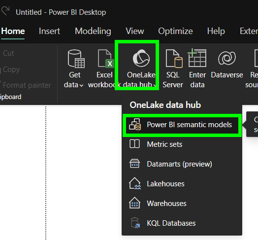  
2. Choose the semantic model was created and right to the button `Connect` click on the down arrown and click on `Edit`.  
3. The model view shows the three tables. Go to the menu `External tools` and open the `Tabular Editor`. If prompted, complete the login to your Power BI account.  
   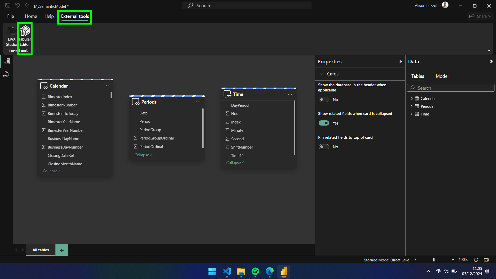
4. Go to [tabular_editor_calendar`Periods`time.cs](tabular_editor_scripts/tabular_editor_calendar`Periods`time.cs) copy raw code. Returns to the Tabular Editor and paste in the C# Script window.  Confirm the used language to generate tables and their respective names. Run the script clicking in the paly icon or pressing `F5`. In the sequence press `Ctrl + S` and close the Tabular Editor.   
     
5. Return to the Power BI Desktop and click on Home>Refresh. If prompted, click on refresh again and close warnings. Your semantic model is configured. Because the Direct Mode, the changes are made in the Fabric too. Refresh your browser to see the changes.

   **Power BI Desktop**  
   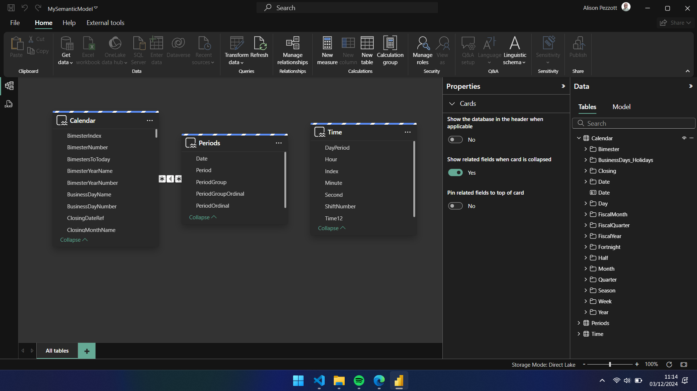  

   **Fabric**    
   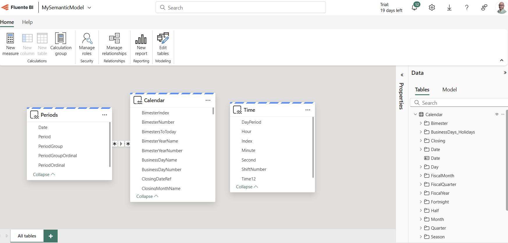      

#### Run C# Scripts in Tabular Editor with connection string

1. In the workspace, go to semantic model settings.  
   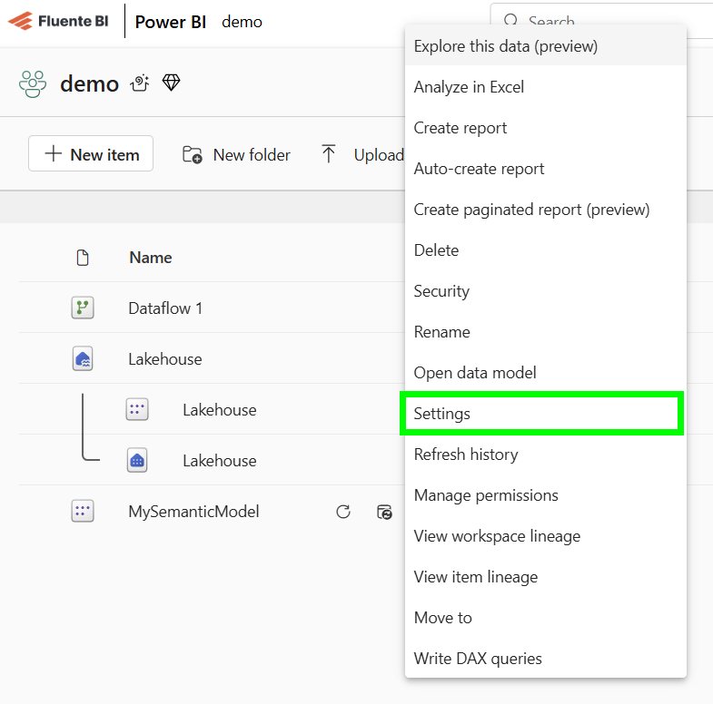  
2. Go to Server Settings and copy the Connection String.  
   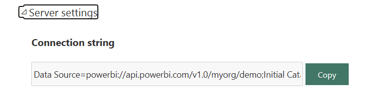  
3. Open Tabular Editor directly, then go to File > Open > From DB.....  
   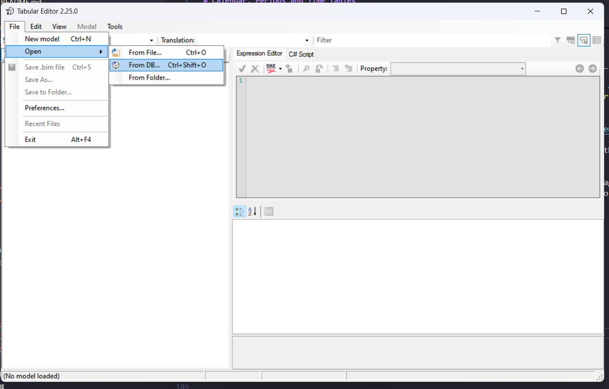  
4. Paste the connection string and check the `Windows Integrated or Azure AD Login` and press Ok. Provide your credentials if necessary.  
   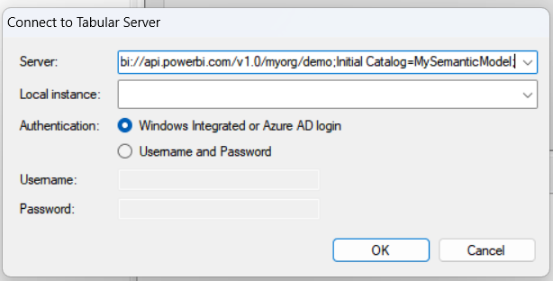  
5. Choose the database and press OK.
   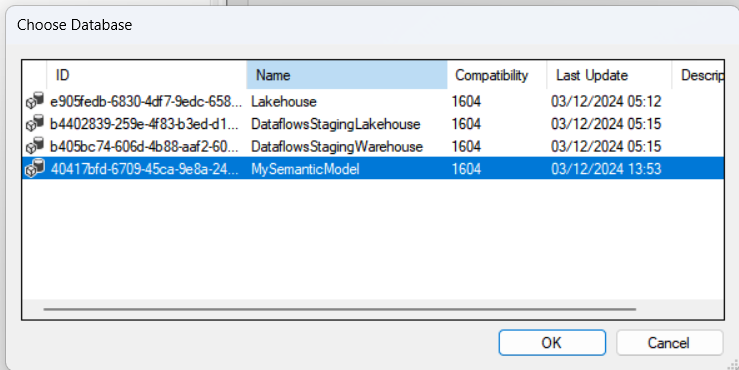  
6. Go to [tabular_editor_calendar`Periods`time.cs](tabular_editor_scripts/tabular_editor_calendar`Periods`time.cs) copy raw code. Returns to the Tabular Editor and paste in the C# Script window.  Confirm the used language to generate tables and their respective names. Run the script clicking in the paly icon or pressing `F5`. In the sequence press `Ctrl + S` and close the Tabular Editor.   
     
7. Done, your semantic model in Fabric is configured. 
     

    

